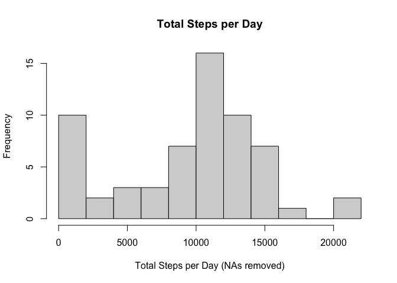
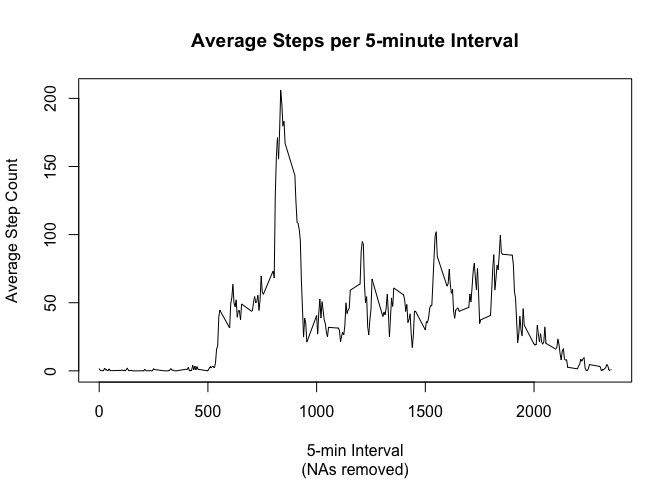
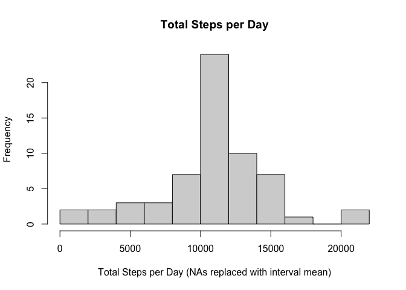
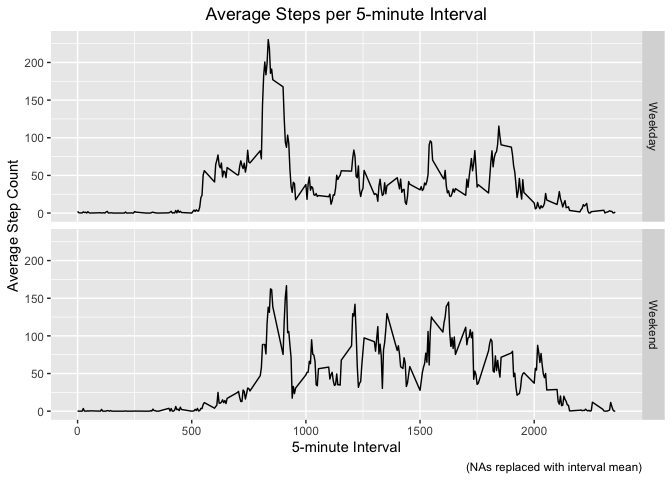

## Loading and preprocessing the data


```r
dataset_url <- paste0("https://d396qusza40orc.cloudfront.net/",
                      "repdata%2Fdata%2Factivity.zip")
downloaded_zipfile <- "./activity.zip"

if (!file.exists(downloaded_zipfile)) {
        download.file(dataset_url, destfile = downloaded_zipfile, 
                      method = "curl", mode = "wb")
}
unzipped_file_folder <- "./activity_data"

if (!file.exists(unzipped_file_folder)) {
        unzip(downloaded_zipfile, exdir = unzipped_file_folder,
              unzip = "internal")
}

activity <- read.csv(file = paste0(unzipped_file_folder, "/", "activity.csv"))
```


```r
activity %>% summarize(overall_frac_NA = mean(is.na(steps)),
                       total_NAs = sum(is.na(steps)))
```

```
##   overall_frac_NA total_NAs
## 1       0.1311475      2304
```

## What is mean total number of steps taken per day?


```r
NA_by_interval <- activity %>%
        group_by(interval) %>%
        summarize(frac_NA = mean(is.na(steps)), count_NA = sum(is.na(steps)))

##How many steps per day?
total_steps_per_day <- activity %>%
        group_by(date) %>%
        summarize(daily_step_total=sum(steps, na.rm = TRUE))

hist(total_steps_per_day$daily_step_total,
     breaks = 15,
     main = "Total Steps per Day",
     xlab = "Total Steps per Day (NAs removed)")
```

<!-- -->

```r
daily_step_stats <-total_steps_per_day %>%
        summarize(mean_daily_steps = mean(daily_step_total),
                  median_daily_steps = median(daily_step_total))
```


## What is the average daily activity pattern?


```r
avg_steps_by_interval <- activity %>%
        group_by(interval) %>%
        summarize(tot_steps = sum(steps, na.rm=TRUE),
                  avg_steps = mean(steps, na.rm=TRUE))

with(avg_steps_by_interval, plot(interval, avg_steps,
        type = "l",
        main = "Average Steps per 5-minute Interval",
        sub = "(NAs removed)",
        xlab = "5-min Interval",
        ylab = "Average Step Count"))
```

<!-- -->


```r
max_avg_steps_by_interval <- activity %>%
        group_by(interval) %>%
        summarize(avg_steps = mean(steps, na.rm=TRUE)) %>%
        slice_max(order_by = avg_steps)
```


## Imputing missing values


```r
imputed_activity <- activity %>% add_column(imputed_steps = NA)

for (i in 1:nrow(imputed_activity)) {
        if (is.na(imputed_activity$steps[i])) {
                imputed_activity$imputed_steps[i] <-
                        avg_steps_by_interval$avg_steps[activity$interval[i] ==
                                                avg_steps_by_interval$interval]
        }
        else {
                imputed_activity$imputed_steps[i] <- imputed_activity$steps[i]
        }
}

rm(i)
```


```r
total_steps_per_day_imputed <- imputed_activity %>%
        group_by(date) %>%
        summarize(daily_step_total_imputed=sum(imputed_steps))

daily_step_stats_imputed <-total_steps_per_day_imputed %>%
        summarize(mean_daily_steps_imputed = mean(daily_step_total_imputed),
                  median_daily_steps_imputed = median(daily_step_total_imputed))

hist(total_steps_per_day_imputed$daily_step_total_imputed,breaks = 15,
     main = "Total Steps per Day",
     xlab = "Total Steps per Day (NAs replaced with interval mean)")
```

<!-- -->


## Are there differences in activity patterns between weekdays and weekends?


```r
imputed_activity <- imputed_activity %>%
        mutate(week_day = weekdays(as.Date(date, "%Y-%m-%d")))

imputed_activity <- imputed_activity %>% add_column(type_of_day = "Weekday")

for (i in 1:nrow(imputed_activity)) {
        if (imputed_activity$week_day[i] %in% c("Saturday", "Sunday")) {
                imputed_activity$type_of_day[i] <- "Weekend"
        }
}

rm(i)

imputed_avg_steps_by_interval_weekday <- imputed_activity %>%
        filter(type_of_day=="Weekday") %>%
        group_by(interval) %>%
        summarize(tot_steps = sum(imputed_steps),
                  avg_steps = mean(imputed_steps)) %>%
        mutate(type_of_day = "Weekday")

imputed_avg_steps_by_interval_weekend <- imputed_activity %>%
        filter(type_of_day=="Weekend") %>%
        group_by(interval) %>%
        summarize(tot_steps = sum(imputed_steps),
                  avg_steps = mean(imputed_steps)) %>%
        mutate(type_of_day = "Weekend")

imputed_avg_steps_by_interval <- rbind(imputed_avg_steps_by_interval_weekday,
                                       imputed_avg_steps_by_interval_weekend)
```


```r
ggplot(imputed_avg_steps_by_interval, aes(interval, avg_steps)) +
        geom_line() + facet_grid(type_of_day ~ .) +
        ggtitle("Average Steps per 5-minute Interval") +
        theme(plot.title = element_text(hjust = 0.5)) +
        labs(x = "5-minute Interval",
             y = "Average Step Count",
             caption = "(NAs replaced with interval mean)")
```

<!-- -->

